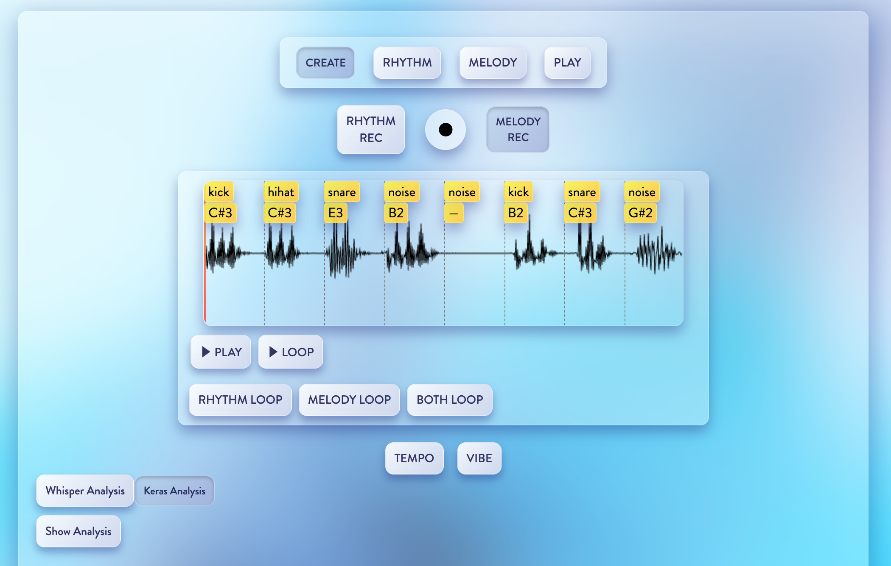

# Micrie_0.1.0-alpha.1

## 🧰 概要

Micrie は、音声を使った直感的な音楽制作を可能にする Web アプリケーションです。  
ユーザーの声からリズムやメロディを抽出し、録音・音声分析・ループ再生まで一貫して行うことができます。  
音楽と機械学習を組み合わせた実験的なツールとして設計されています。

音声データから特徴量を抽出し、リズムやメロディに分類する仕組みを備えています。  
フロントエンドは React、バックエンドは Flask（Python）で構築されています。

---

## 🎼 このアプリでできること

Micrie では、自分の声を録音し、それをリズムやメロディの音源に変換することで、直感的な音楽制作を行うことができます。  
たとえば、「ぼ」「ち」「ぱ」といった発声を通じて、それぞれキック・ハイハット・スネアに分類したり、自由な音をメロディとして分析・再構成することができます。


- 🎙 **録音**  
  録音ボタン（●）を押すと、最初に4カウントが入り、その後1小節（4拍）分の音声が録音されます。録音された音は、1/2拍ごと（全8チャンク）に分割され、それぞれのチャンクで音声が分類・分析されます。

- 🥁 **RHYTHM REC モード（リズム録音）**  
  RHYTHM REC を選択した状態で録音すると、以下のように分類されます：

### 発音 / 分類される音源

| 発音 | 分類名     | 補足     |
|------|------------|----------|
| 「ぼ」 | Kick       |          |
| 「ち」 | Hihat      |          |
| 「ぱ」 | Snare      |          |
| 無音   | Noise      | （休符） |  

  分類された結果は、各チャンクの左上に黄色いラベルで表示されます。

- 🎵 **MELODY REC モード（メロディ録音）**  
  MELODY REC を選択した状態で録音すると、各チャンクの中で音程が分析され、音階として分類されます。発音方法に制限はなく、自由に音を出すことができます。無音の部分はrest(休符)として分類されます。  
  分析結果は、同様に各チャンクの左上に黄色いラベルで表示されます。

---

## 📁 ディレクトリ構成（抜粋）

```
Micrie_0.1.0-alpha.1
├── client/                # React (Vite) フロントエンド
│   ├── public/            # 静的アセット
│   ├── src/               # React のソースコード
│   ├── index.html         # HTML エントリーポイント
│   ├── package.json       # フロントエンドの依存管理
│   └── vite.config.ts     # Vite の設定ファイル
├── server/                # Flask バックエンドAPI
│   ├── model/             # 学習済みモデルファイル
│   ├── main_api.py        # Flask アプリのエントリーポイント
│   ├── pitch_api.py       # 音高分析API
│   ├── predict_api.py     # 推論API（リズム/メロディ分類）
│   ├── whisper_api.py     # 音声認識API（OpenAI Whisper）
│   ├── train_model.py     # モデル学習用スクリプト
│   └── requirements.txt   # Python依存ライブラリ一覧
├── .gitignore             # Git管理から除外するファイル指定
└── README.md              # このファイル
```

---

## 🔧 セットアップ手順

### 1. Python仮想環境の作成・有効化

```bash
cd server
python3 -m venv .venv
source .venv/bin/activate  # Windowsの場合: .venv\Scripts\activate
```

### 2. 依存ライブラリのインストール

```bash
pip install -r requirements.txt
```

※ `crepe`, `whisper`, `tensorflow`, `flask`, `flask-cors` などが含まれます。

### 3. Flask API の起動

```bash
python main_api.py
```

---

## 🖥 フロントエンド（React）の起動

```bash
cd client
npm install
npm run dev
```

ブラウザで `http://localhost:5173` にアクセスしてください。

---

## 📡 API エンドポイント（例）

- `POST /pitch`: 音声から音高を推定
- `POST /predict`: 音声から特徴を抽出し分類
- `POST /whisper`: 音声をテキストに変換

---

## 📝 補足

- Python: 推奨バージョン 3.12
- Node.js: 推奨バージョン 18+
- `.vscode/` はローカル用設定のため公開リポジトリには含めていません

---

## 🧪 学習済みモデルとデータについて

- このアプリのモデルは、制作者自身の声を用いて学習しています
- オリジナルのモデルを作成したい場合は、`server/dataset/` ディレクトリ内の `kick/`, `snare/`, `hihat/`, `noise/` フォルダにそれぞれ録音したサンプルを分類して保存してください。
  サンプル音源は `.wav` 形式で、各分類ごとに約1秒程度の音声を100サンプルほど収録すると、精度の良い学習が行えます。
  以下のコマンドを `server/` ディレクトリ内で実行することで、独自モデルの学習が可能です：

```bash
cd server
python train_model.py
```
- 音声ファイルには個人の声紋という生体情報が含まれるため、プライバシー保護の観点から音声データ本体は公開していません
- 学習済みモデル（.kerasファイル）のみを使用して推論を行う構成となっており、アプリケーションの動作には音声データは不要です

---

- 
## 🕹 アプリの使い方（UIガイド）

現在は「CREATE」モードのみ実装されており、他のモードはUIの土台のみ存在しています。  
将来的に以下のような機能拡張を予定しています：

- **CREATE**：録音と音声分析を通じて、リズム・メロディ素材を生成するモード（実装済み）
- **RHYTHM**：録音済みのリズム素材を加工・編集できるモード（未実装）
- **MELODY**：録音済みのメロディ素材を加工・編集できるモード（未実装）
- **PLAY**：生成したループ素材を用いて自由に演奏・実験できるモード（未実装）

---

### 🔘 各ボタンの説明（画面上から順に）

#### 🎙 録音モード切り替えボタン
- **RHYTHM REC**：リズムの録音モードに切り替える
- **MELODY REC**：メロディの録音モードに切り替える

#### ● 録音ボタン
- 円形の録音ボタンをクリックすることで録音を開始

#### ▶︎ PLAY / ■ STOP
- 録音した音声の再生・停止を切り替えるトグルボタン

#### ▶︎ LOOP / ■ STOP
- 音声分析を経て生成されたループ素材の再生・停止を切り替えるトグルボタン

#### 🔁 ループ対象の選択
- **RHYTHM LOOP**：リズム音源のみループ再生
- **MELODY LOOP**：メロディ音源のみループ再生
- **BOTH LOOP**：両方をループ再生

#### ⏱ TEMPO
- 再生や録音のテンポ（速度）を変更できるコントロール

#### ✨ VIBE（未実装）
- 雰囲気に応じたループ音源の自動アレンジ機能（今後実装予定）

#### 🤖 リズム素材分析モード切り替えボタン
- **Whisper Analysis**：Whisper（音声認識モデル）を用いたリズム素材の音声分析を実行  
- **Keras Analysis**：Keras（学習済み分類モデル）を用いたリズム素材の音声分析を実行
（※基本的に精度は Keras の方が高いため、通常はこちらの使用を推奨します）

#### 🧪 Show Analysis（開発用）
- 分析結果の詳細情報を表示するためのボタン
- 主に開発・デバッグ目的で利用します

---

## 🧠 制作者メモ
- この作品は音楽×機械学習の実験的なアプローチとして構築されました
- UI/UX・パフォーマンスは今後改良予定です

---

## 🖼 アプリ全体のスクリーンショット

以下は Micrie アプリの全体画面の例です：

