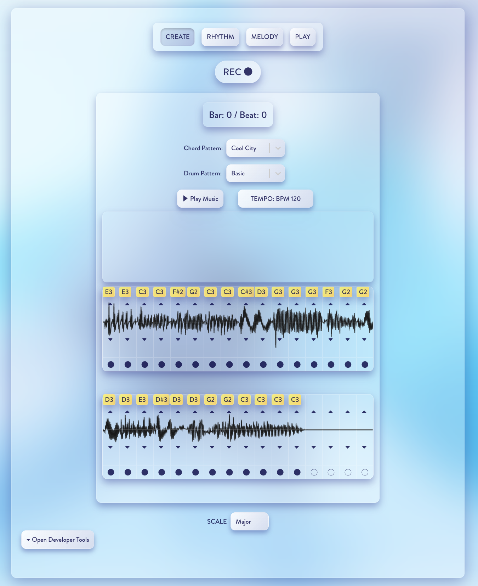
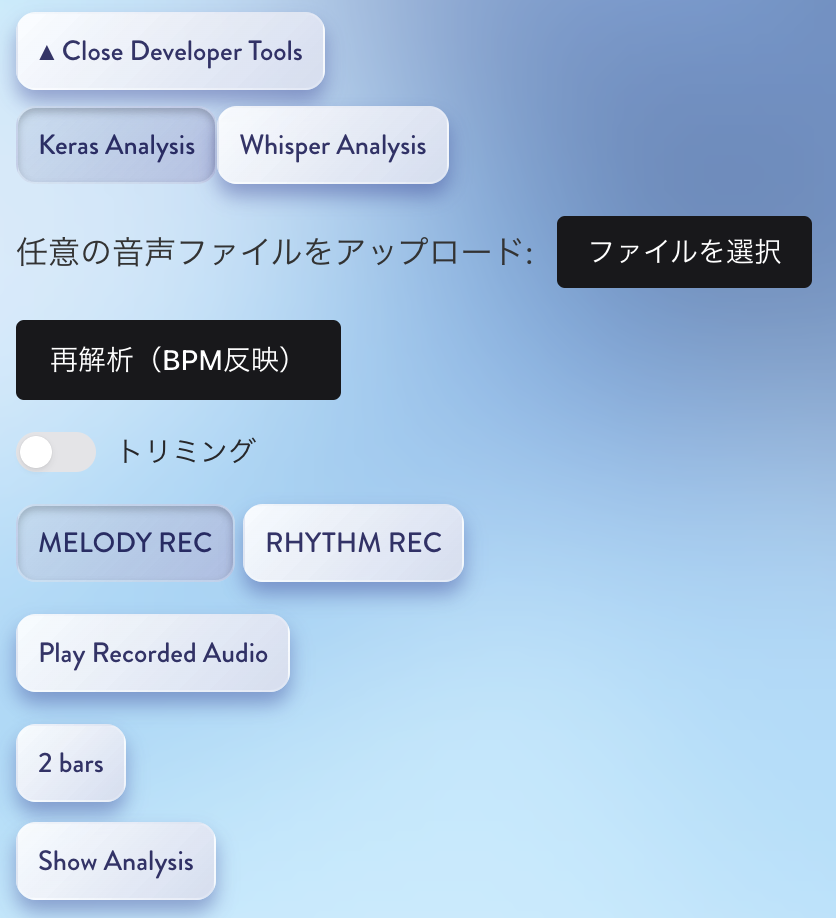

# Micrie_0.1.0-alpha.2

## いつでも、だれでも、つくれる音楽『Micrie』

Micrieは、歌うだけで、あなたの思い描いた音楽を形作る、新しい音楽制作アプリです。

音声データから特徴量を抽出し、リズム・メロディを解析・分類するアプリケーションです。  
フロントエンドは React、バックエンドは Flask（Python）で構成されています。

🎥 **Micrieの紹介動画はこちらからご覧いただけます。**  
https://www.youtube.com/watch?v=7agMd1vKpDM

---

## 📌 最新の変更（Micrie_0.1.0-alpha.2）

- 🎵 **MELODY REC モードを大幅アップデート**  
  - コード進行とドラムの「プリセット」を選ぶだけで、自動で伴奏が設定されるようになりました  
  - メロディを録音すると、選んだ伴奏に合わせて自動的に再生・同期されるため、録音だけで1曲のベースが完成します

- 🥁 **RHYTHM REC 機能の一時移行**  
  - これまでのリズム録音機能（RHYTHM REC）は、開発中のため一時的に Developer Tools 内に移動しました  

- 🧼 **UI改善**  
  - 一部ボタンや文言の表示を見直し、使いやすさを向上させました

---

## 📁 ディレクトリ構成

```
Micrie_0.1.0-alpha.2
├── client/                # React (Vite) フロントエンド
│   ├── public/            # 静的アセット
│   ├── src/               # React のソースコード
│   ├── index.html         # HTML エントリーポイント
│   ├── package.json       # フロントエンドの依存管理
│   └── vite.config.ts     # Vite の設定ファイル
├── server/                # Flask バックエンドAPI
│   ├── model/             # 学習済みモデルファイル
│   ├── main_api.py        # Flask アプリのエントリーポイント
│   ├── pitch_api.py       # 音高解析API
│   ├── predict_api.py     # 推論API（リズム/メロディ分類）
│   ├── whisper_api.py     # 音声認識API（OpenAI Whisper）
│   ├── train_model.py     # モデル学習用スクリプト
│   └── requirements.txt   # Python依存ライブラリ一覧
├── .gitignore             # Git管理から除外するファイル指定
└── README.md              # このファイル
```

---

## 📊 処理の流れ（概要）

1. ユーザーが音声を録音またはアップロード  
2. Flask APIを通じてサーバー側で録音した音声波形を処理  
3. 音声解析モデルにより音高やリズムが解析され、結果を配列に格納し返却  
4. フロントエンドで結果を表示・再生

---

## 🔧 セットアップ手順

### 1. Python仮想環境の作成・有効化

```bash
cd server
python3 -m venv .venv
source .venv/bin/activate  # Windowsの場合: .venv\Scripts\activate
```

### 2. 依存ライブラリのインストール

```bash
pip install -r requirements.txt
```

※ `crepe`, `whisper`, `tensorflow`, `flask`, `flask-cors` などが含まれます。

### 3. Flask API の起動

```bash
python main_api.py
```

---

## 🖥 フロントエンド（React）の起動

```bash
cd client
npm install
npm run dev
```

ブラウザで `http://localhost:5173` にアクセスしてください。

---

## 🎼 このアプリでできること

このアプリでは、自分の声を録音すると、それを実際のリズムやメロディの音源に変換し、直感的に音楽制作を行うことができます。

- 🎙 **録音**  
  録音ボタン（REC ●）を押すと、最初に4カウントが入り、その後2小節（4拍）分の音声が録音されます。録音された音は、1/4拍ごと（全32チャンク）に分割され、それぞれのチャンクで音声が分類・解析されます。

- 🎵 **MELODY REC モード（メロディ録音）**
  MELODY REC を選択した状態で録音すると、各チャンクの中で音程が解析され、音階として分類されます。発音方法に制限はなく、自由に音を出すことができます。無音の部分は(◯ 休符)として分類されます。  
  解析結果は各チャンクの左上に黄色いラベルで表示されます。

  録音前にコード進行とドラムのプリセットを選択できます。  
  選んだプリセットに応じた伴奏とドラムが再生され、録音したメロディと自動的に同期されます。

- 🥁 **RHYTHM REC モード（開発者向け）**
  RHYTHM REC を選択した状態で録音すると、以下のように分類されます：

  #### 発音 / 分類される音源
  
  | 発音 | 分類名     | 補足     |
  |------|------------|----------|
  | 「ぼ」 | Kick       |          |
  | 「ち」 | Hihat      |          |
  | 「ぱ」 | Snare      |          |
  | 無音   | Noise      | （休符） |  

  分類された結果は、各チャンクの左上に黄色いラベルで表示されます。
  
  ※ 現在このモードは Developer Tools 内に移動しています。解析機能は動作しますが、結果は「Show Analysis」ボタンでテキストとして確認できるのみで、音程の修正や音源の再生は現在対応していません。

---

## 🚧 モード別対応状況

現在は「CREATE」モードのみ実装されており、他のモードはUIの土台のみ存在しています。  
将来的に以下のような機能拡張を予定しています：

- **CREATE**：録音と音声解析を通じて、リズム・メロディ素材を生成するモード（実装済み）
- **RHYTHM**：録音済みのリズム素材を加工・編集できるモード（未実装）
- **MELODY**：録音済みのメロディ素材を加工・編集できるモード（未実装）
- **PLAY**：生成したループ素材を用いて自由に演奏・実験できるモード（未実装）

| モード名   | 状況       | 説明 |
|------------|------------|------|
| CREATE     | ✅ 実装済み | 音声を録音し、伴奏付きで再生・同期 |
| RHYTHM     | 🔧 開発中   | 今後実装予定 |
| MELODY     | 🔧 開発中   | 今後実装予定 |
| PLAY       | 💤 未実装   | 今後実装予定 |

---

## 📡 API エンドポイント

- `POST /pitch`: 音声から音高を推定
- `POST /predict`: 音声から特徴を抽出し分類
- `POST /whisper`: 音声をテキストに変換し分類

---

### 🔘 各ボタンの説明（画面上から順に）

#### ● REC（録音）ボタン
- クリックすると録音が始まります。4カウント後に2小節（8拍）分の音声が録音されます。

#### Chord Pattern 選択ボタン
- コード進行のプリセットを選択します。  
▶ Play Music ボタンを押すと、選んだコード進行が伴奏として再生されます。

#### Drum Pattern 選択ボタン
- ドラムパターンのプリセットを選択します。  
▶ Play Musicボタンを押すと、選んだドラムパターンが伴奏として再生されます。

#### ▶ Play Musicボタン
- 録音データをもとに生成されたメロディーに、選択したコード進行とドラムの伴奏が加わり、一斉に再生されます。  
  自分が作った音楽をその場で試聴できます。

#### ⏱ TEMPOボタン
- BPM（テンポ）を設定できます。録音や再生速度に影響します。

#### 音程・音符休符 修正ボタン
- ▲ ▼ ボタンで各チャンクごとの音程を手動で上下に調整できます。
◯ 休符 | ● 音符 の切り替えも可能です。

#### Scale 切り替えボタン
- 音程全体を特定のスケールにリマッピングします。（基本的にはMajorを推奨）

#### ▾ Open Developer Tools / ▴ Close Developer Tools
- 開発者向けの詳細機能を開閉できます。

---

## 🧪 Developer Tools（開発者向け機能）

開発者向けの機能を利用するためのパネルです。音声ファイルの読み込み、モデルの変更、録音・分析のモード切り替え等が行えます。

#### Keras Analysisボタン
- 学習済みKerasモデルを使ってアップロードした音声のリズムを解析します。

#### Whisper Analysisボタン
- Whisper（音声認識モデル）を使って、音声をテキストに変換します。

#### 音声ファイル読み込みボタン (ファイルを選択)
- 任意の音声ファイル（.wav など）をアップロードしてMelodyの解析に使用します。

#### 再解析（BPM反映）ボタン
- アップロードした音声に対し、現在設定されているBPMを反映して再解析を行います。

#### トリミングボタン
- ONにすると、アップロードした音声をBPMに基づいて自動的に録音時間分にトリミングします。  
  例：120 BPM の場合、4 秒に自動カットされます。

#### MELODY RECボタン
- MELODY REC を選択すると、録音した音声がメロディとして解析されます。  

#### RHYTHM RECボタン
- RHYTHM REC を選択すると、録音した音声がリズムとして解析されます。

#### Play Recorded Audio / Stop Recorded Audio
- アップロードした音声ファイルを再生します。

#### 小節(bars)数選択ボタン
- 録音および解析する長さ（小節数）を切り替えるボタンです。  
  ※ 2 Bars 以外を選択すると、伴奏やドラムのループとずれてしまう可能性があります。

#### Show Analysis / Hide Analysis
- 解析結果の詳細をテキストとして表示します（画面下部に表示されます）。

---

## 💡 ユースケース例

- 自分の声で即興メロディを録音し、そのまま伴奏付きで試聴  
- ボイスパーカッションや打楽器的な音を録音してリズム分類を試す  
- 独自データセットを用いた音分類モデルの学習・検証

---

## 🧪 学習済みモデルとデータについて

※このセクションは「RHYTHM REC モード」で使用するリズム分類モデル（kick / snare / hihat / noise）に関する内容です。MELODY REC モードでの音程解析には関係ありません。

- このアプリのモデルは、制作者自身の声を用いて学習しています
- オリジナルのモデルを作成したい場合は、kick / snare / hihat / noise に対応する音声をそれぞれ約1秒程度で100サンプルほど録音し、`server/dataset/` 内の各フォルダに格納してください  
  以下のコマンドを `server/` ディレクトリ内で実行することで、独自モデルの学習が可能です：

```bash
cd server
python train_model.py
```
- 音声ファイルには個人の声紋という生体情報が含まれるため、プライバシー保護の観点から音声データ本体は公開していません
- 学習済みモデル（.kerasファイル）のみを使用して推論を行う構成となっており、アプリケーションの動作には音声データは不要です

---

## 🔊 使用音源とライセンスについて

このアプリでは音源素材として、Ivy Audio の「Piano in 162」ライブラリ由来の単音録音データを加工して使用しています。

この音源は Creative Commons Attribution 4.0 International License（CC BY 4.0）に基づいて使用されており、著作権者への適切なクレジットを表記することで自由に使用・改変・再配布が可能です。

> This project uses audio samples derived from "Piano in 162" by Ivy Audio,  
> released under the Creative Commons Attribution 4.0 International License.  
> https://vstbuzz.com/freebies/piano-in-162/

また、リズム分類モデルの学習には Freesound に投稿された以下のCCライセンス音源を使用しています：

- "kick135.wav" by Vrezerino — [CC0 1.0](https://freesound.org/people/Vrezerino/sounds/16709/)
- "Snare, 14''" by Micah10 — [CC BY 4.0](https://freesound.org/people/Micah10/sounds/791274/)
- "Half Open Hi-Hat" by Micah10 — [CC BY 4.0](https://freesound.org/people/Micah10/sounds/791276/)

Micah10の音源は Creative Commons Attribution 4.0 License（CC BY 4.0）に基づいて使用しており、著作権者へのクレジットを付すことで自由に使用・改変・再配布が可能です。


---

## 🧠 制作者メモ
- この作品は音楽×機械学習の実験的なアプローチとして構築されました
- UI/UX・パフォーマンスは今後改良予定です

---

## 🖼 スクリーンショット

### Micrie アプリ全体画面



### Developer Toolsの画面




---

## 📝 補足

- Python: 推奨バージョン 3.12
- pip: 推奨バージョン 23+
- npm: 推奨バージョン 9+
- Node.js: 推奨バージョン 18+
- `.vscode/` はローカル用設定のため公開リポジトリには含めていません

---
