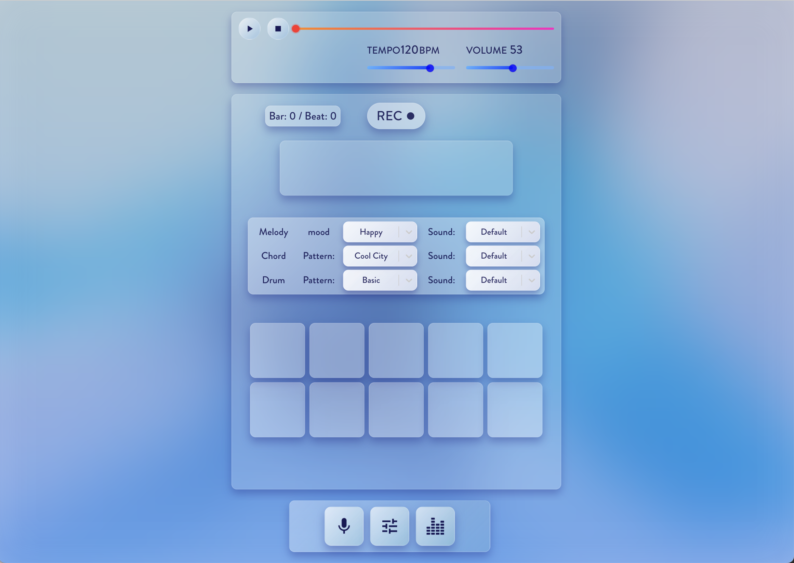
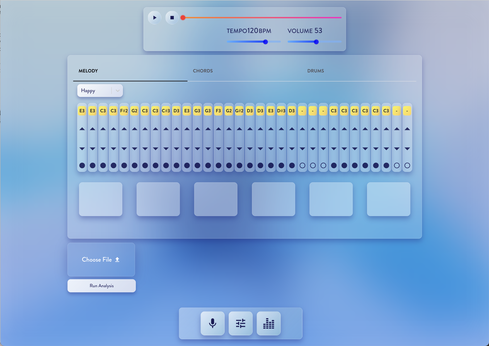
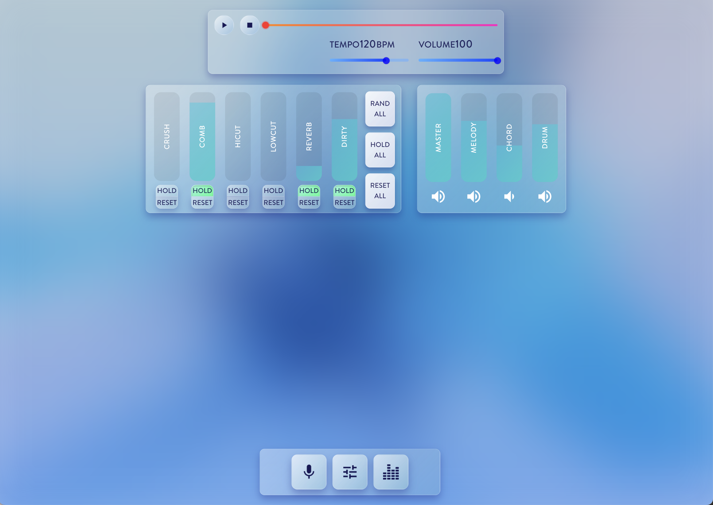

# Micrie_0.1.0-beta.1

## いつでも、だれでも、つくれる音楽『Micrie』

Micrieは、歌うだけで、あなたの思い描いた音楽を形作る、新しい音楽制作アプリです。

音声データから特徴量を抽出し、リズム・メロディを解析・分類します。
フロントエンドは React、バックエンドは Google Cloud Run (Python/Flask)、認証は Firebase を使用しています。

🎥 **Micrieの使い方はこちらからご覧いただけます。**
準備中

---

## 🚀 デプロイ先

Micrieは以下のURLからアクセスできます。

- **フロントエンド (Vercel):** [https://micrie.vercel.app/](https://micrie.vercel.app/)
- **バックエンド (Google Cloud Run):** APIエンドポイントとして利用
- **認証 (Firebase Authentication):** ユーザー認証機能

---

## 📌 最新の変更（Micrie_0.1.0-beta.1）

今回のアップデート（beta.1）では、アプリケーションのコア構造を全面的に刷新し、多数の新機能と改善を加えました。

- **3つの新モード体制への移行**
  - アプリケーションの機能を `RECORDING`, `EDIT`, `PERFORMANCE` の3つの主要モードに再編しました。
    - **RECORDING:** 歌声や鼻歌からメロディを自動生成します。
    - **EDIT:** 生成したメロディ、コード、ドラムを直感的に編集できます。
    - **PERFORMANCE:** 完成した楽曲にエフェクトをかけたり、ミキサーで音量バランスを調整して楽しめます。

- **アプリケーションの公開**
  - フロントエンドを **Vercel** に、バックエンドを **Google Cloud Run** にデプロイし、誰でもすぐにアクセスして利用できるようになりました。ユーザー認証には **Firebase** を導入しています。

- **UI/UXの全体的な改善**
  - 新しいモード構成に合わせて、UIデザインを全面的に見直しました。より直感的で一貫性のある操作性を実現しています。

- **アーキテクチャの刷新 (FSD)**
  - フロントエンドの構造を **Feature-Sliced Design (FSD)** に基づいて再設計しました。これにより、コードの保守性と拡張性が大幅に向上し、今後の迅速な機能追加が可能になりました。

---

## 🎼 このアプリでできること

Micrieは3つの主要なモードで構成されています。

- **RECORDING:** 歌声や鼻歌を録音し、メロディの元となる素材を生成するモード。
- **EDIT:** 既存の音声ファイルをアップロードして解析したり、`Melody`, `Chords`, `Drums` の各パートをリアルタイムに編集したりできるモード。
- **PERFORMANCE:** 楽曲にエフェクトをかけたり、ミキサーで音量バランスを調整して演奏できるモード。

| モード名      | 状況       | 説明                                                                 |
|---------------|------------|----------------------------------------------------------------------|
| **RECORDING** | ✅ 実装済み | 歌声を録音し、メロディ素材を生成します。                               |
| **EDIT**      | ✅ 実装済み | 音声ファイルを解析したり、メロディ、コード、ドラムをリアルタイムに編集したりできます。 |
| **PERFORMANCE** | ✅ 実装済み | エフェクトやミキサーを使って、楽曲の再生を楽しめます。                 |


---

## 📁 ディレクトリ構成

```
Micrie/
├── client/                # フロントエンド (React, Vite, TypeScript)
│   ├── src/               # ソースコード (Feature-Sliced Design 準拠)
│   │   ├── app/           # アプリ全体の設定、ルーティング、グローバルプロバイダ
│   │   ├── pages/         # 各ページのコンポーネント (例: Recording, Edit, Performance)
│   │   ├── widgets/       # 複数の機能を組み合わせたUI部品 (例: サイドバー, 再生バー)
│   │   ├── features/      # 特定のユースケースを実現する機能 (例: 録音機能, コード編集)
│   │   ├── entities/      # ビジネスエンティティ (例: User, Project, Sound)
│   │   └── shared/        # 複数のレイヤーで共有される汎用コード (UIキット, APIクライアント, ヘルパー関数)
│   ├── public/            # 静的アセット (画像, フォントなど)
│   ├── package.json       # 依存関係の管理
│   └── vite.config.ts     # Vite の設定
│
├── server/                # バックエンド (Python, Flask)
│   ├── model/             # 学習済みモデルファイル (.keras)
│   ├── main_api.py        # Flask アプリのエントリーポイント
│   ├── pitch_api.py       # 音高解析API
│   ├── predict_api.py     # 推論API（リズム/メロディ分類）
│   ├── whisper_api.py     # 音声認識API（OpenAI Whisper）
│   ├── train_model.py     # モデル学習用スクリプト
│   └── requirements.txt   # Python依存ライブラリ一覧
│
├── .gitignore             # Git管理から除外するファイル指定
└── README.md              # このファイル
```

---

## 🔧 セットアップ手順 (ローカル開発環境)

### 1. Python仮想環境の作成・有効化

```bash
cd server
python3 -m venv .venv
source .venv/bin/activate  # Windowsの場合: .venv\Scripts\activate
```

### 2. 依存ライブラリのインストール

```bash
pip install -r requirements.txt
```

※ `crepe`, `whisper`, `tensorflow`, `flask`, `flask-cors` などが含まれます。

### 3. Flask API の起動

```bash
python main_api.py
```
### 4. フロントエンド（React）の起動

```bash
cd client
pnpm install
pnpm dev
```

ブラウザで `http://localhost:5173` にアクセスしてください。

---

## 📡 API エンドポイント

- `POST /pitch`: 音声から音高を推定
- `POST /predict`: 音声から特徴を抽出し分類 (未デプロイ)
- `POST /whisper`: 音声をテキストに変換し分類 (未デプロイ)

---

## 🧪 Developer Tools（開発者向け機能）

開発者向けの機能を利用するためのパネルです。モデルの変更、録音・分析のモード切り替え等が行えます。

#### Keras Analysisボタン
- 学習済みKerasモデルを使ってアップロードした音声のリズムを解析します。

#### Whisper Analysisボタン
- Whisper（音声認識モデル）を使って、音声をテキストに変換します。

---

## 💡 ユースケース例

- **鼻歌から作曲:** RECORDINGモードで思いついたメロディを口ずさみ、即座に楽曲のドラフトを作成。
- **楽曲の編集とアレンジ:** EDITモードを使い、生成されたメロディ、コード、ドラムを好みに合わせてリアルタイムに調整・再構成。
- **ライブパフォーマンス:** PERFORMANCEモードでエフェクトをかけたり、ミキサーで音量バランスを調整したりして、インタラクティブに楽曲を演奏。
- **耳コピと練習:** EDITモードで好きな曲のボーカル音源をアップロードしてメロディを解析し、楽曲の学習やアレンジの参考に。

---

## 🧪 学習済みモデルとデータについて (リズム分類)

※このセクションで解説するリズム分類（kick / snare / hihat / noise）機能は、現在UIからは利用できません。train_model.pyはピッチ解析（メロディ生成）の機能とは無関係です。

- このアプリのモデルは、制作者自身の声を用いて学習しています
- オリジナルのモデルを作成したい場合は、kick / snare / hihat / noise に対応する音声をそれぞれ約1秒程度で100サンプルほど録音し、`server/dataset/` 内の各フォルダに格納してください
  以下のコマンドを `server/` ディレクトリ内で実行することで、独自モデルの学習が可能です：

```bash
cd server
python train_model.py
```
- 音声ファイルには個人の声紋という生体情報が含まれるため、プライバシー保護の観点から音声データ本体は公開していません
- 学習済みモデル（.kerasファイル）のみを使用して推論を行う構成となっており、アプリケーションの動作には音声データは不要です

---

## 🔊 使用音源とライセンスについて

このアプリでは音源素材として、Ivy Audio の「Piano in 162」ライブラリ由来の単音録音データを加工して使用しています。

この音源は Creative Commons Attribution 4.0 International License（CC BY 4.0）に基づいて使用されており、著作権者への適切なクレジットを表記することで自由に使用・改変・再配布が可能です。

> This project uses audio samples derived from "Piano in 162" by Ivy Audio,
> released under the Creative Commons Attribution 4.0 International License.
> https://vstbuzz.com/freebies/piano-in-162/

また、リズム分類モデルの学習には Freesound に投稿された以下のCCライセンス音源を使用しています：

- "kick135.wav" by Vrezerino — [CC0 1.0](https://freesound.org/people/Vrezerino/sounds/16709/)
- "Snare, 14''" by Micah10 — [CC BY 4.0](https://freesound.org/people/Micah10/sounds/791274/)
- "Half Open Hi-Hat" by Micah10 — [CC BY 4.0](https://freesound.org/people/Micah10/sounds/791276/)

Micah10の音源は Creative Commons Attribution 4.0 License（CC BY 4.0）に基づいて使用しており、著作権者へのクレジットを付すことで自由に使用・改変・再配布が可能です。


---

## 🧠 制作者メモ
- この作品は音楽×機械学習の実験的なアプローチとして構築されました
- UI/UX・パフォーマンスは今後改良予定です

---

## 🖼 スクリーンショット

### RECORDING-MODE



### EDIT-MODE (MELODY)



### PERFORMANCE-MODE



---

## 📝 補足

- Python: 推奨バージョン 3.12
- pip: 推奨バージョン 23+
- pnpm: 推奨バージョン 9+
- Node.js: 推奨バージョン 18+